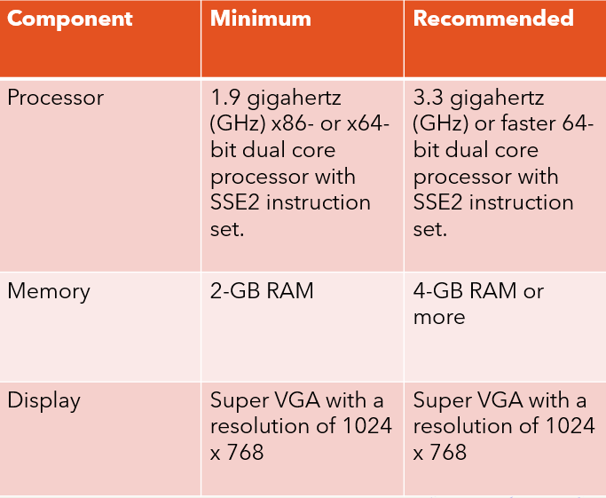

# SeekaBook-Backend

https://youtu.be/jZite48y9w8

## Understanding Problem Statement
Seek-A-Book is a platform to buy second-hand books which are both cost-effective and environment friendly
The website will be user interactive and can be used locally.

## Problem Statement
1. Students who are done studying from textbooks don’t know what to do with them. 
2. Students who wish to buy second hand books have a hard time finding books in a decent condition.

## Limitations 

1. Existing websites include unnecessary delivery costs
2. Existing websites often have mixed reviews about products.
3. If customers need to verify or check product quality before purchasing, they cannot contact the seller to confirm. 

## Objective
1. Students who want to sell books can find an interface to do so.
2. Students willing to buy second-hand books can find a user-friendly website for the same.

## Novelty

1. The website helps prospective buyers look at books before they invest in them.
2. Since the sellers shown will be in their vicinity, they can exchange the book in person which cuts all shipping costs.
3. Some sellers can volunteer to donate their books.
4. This website can be implemented locally at a very small scale.

## Existing Work

Existing website usually ask for unnecessary information
Orders from existing websites will always include shipping costs.
These usually contain pop-ups.

## Software Requirements
### 1. Explore Books
 This button will display all books present in our database so that user can have a look on all of them.
 Information like Book name, description, price, and way to contact seller will also be displayed.
### 2. Search Bar
  Search option will allow user to find specific book that they need.
### 3. Post Ad
  This feature will allow buyers to display their book ads so that prospective buyers can reach them out.
### 4. Search Filter
  Login interface will allow users and admin to login into the system by entering user id and password before they are allowed to enter the system.
### 5. Buyer
Buyer may use the Search Filter to sort or filter the search results by University and price.

## Hardware Requirements
The following table lists the minimum and recommended hardware requirements for the web application.

